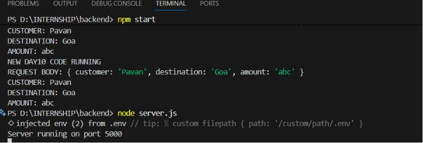
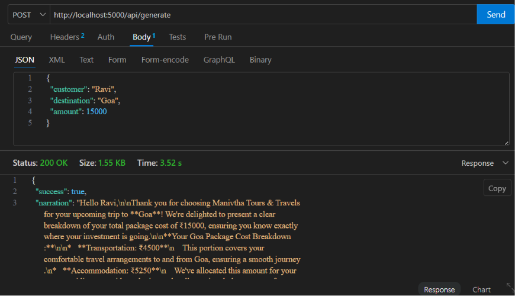
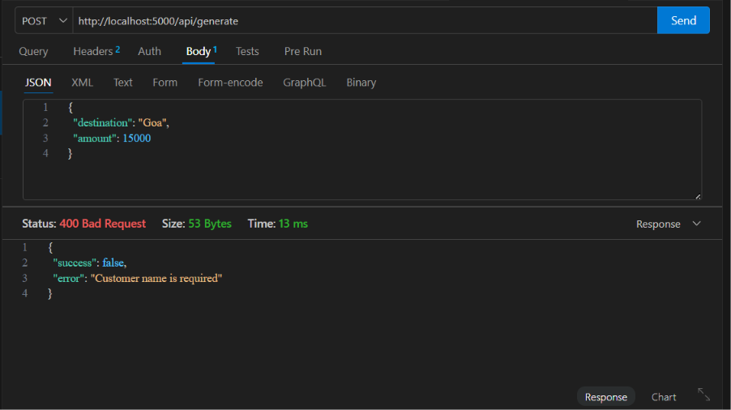
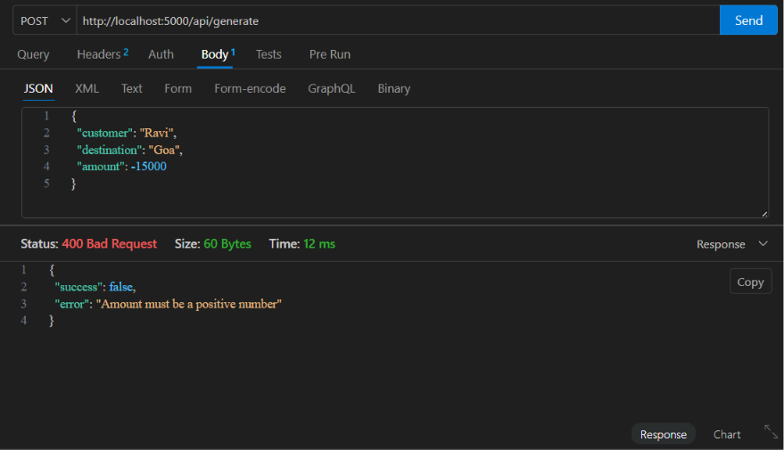
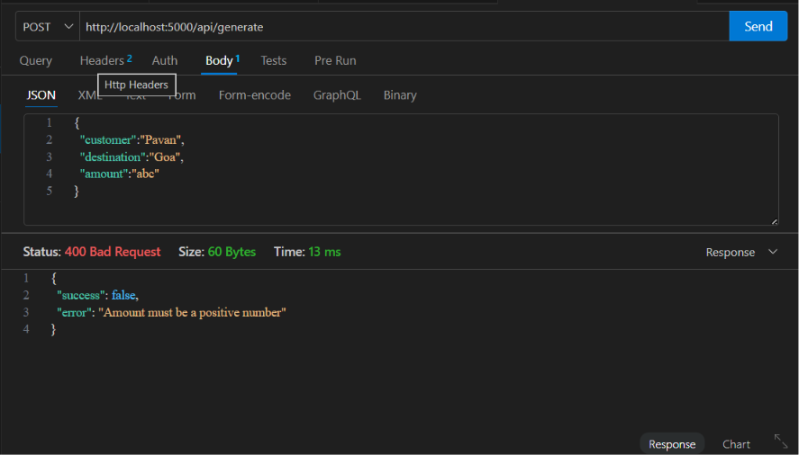

# Day 10 Summary

## Activities Completed

- Integrated Prompt V3 into backend API
- Improved request validation
- Implemented error handling
- Tested API with valid and invalid inputs
- Verified OpenRouter integration

## Results

The AI Trip Cost Breakdown Narrator backend successfully generated customer-friendly narrations and handled invalid inputs appropriately.

## Conclusion

The backend service is stable and ready for frontend integration.

Server running:

Successful API response:

Missing customer validation:

Negative amount validation:

Invalid amount (abc) validation

